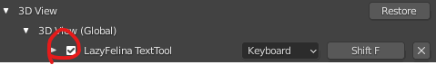

# LazyFelina Addon
LazyFelina is in the beta phase, but is avalible for anyone to use. I create it with the help of Darkfall's scripting tutorials.

## Thank you:
  * BreadcrumbIsTaken and Therawfish for helping me when I had a issue with the sunbeams node
  * gurpreet_exe and Phoenix_209 for helping me with making the TextTool reset
  * Lord3009 for the idea of adding the Boosh shortcut
  * Vortex Animation for teaching me that the Enviroment pass can be used to isolate objects in the sunbeams node

## Repository Info 
Place for the LazyFelina Addon. Here, you can report bugs and suggest new features. Currently, it has a quick panel for Cycles and EEVEE, Text Tool panel for better text workflow, and a mist shortcut for compositing 
To install, install the .py script. To update, remove the addon and reinstall

For any keybinds, make sure you go into keymap, 3D View, 3D View Global, and disable the keybind. Then reenable it.

